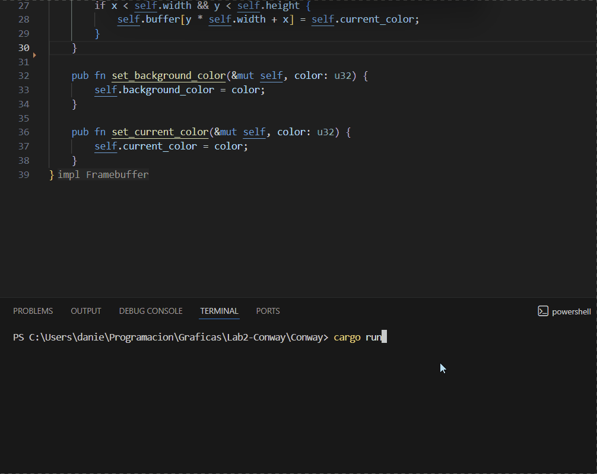

# Conway's Game of Life

Implementación del **Conway's Game of Life** utilizando Rust y `minifb` para el renderizado en tiempo real.

## Descripción

El proyecto implementa el algoritmo de Conway's Game of Life utilizando un framebuffer de baja resolución que es escalado a una ventana de mayor tamaño.

Cada célula puede estar en uno de dos estados:

* Viva
* Muerta

En cada generación se analizan los 8 vecinos de cada célula y se aplican las reglas de Conway:

1. Una célula viva con menos de dos vecinos vivos muere por subpoblación.
2. Una célula viva con dos o tres vecinos vivos sobrevive.
3. Una célula viva con más de tres vecinos vivos muere por sobrepoblación.
4. Una célula muerta con exactamente tres vecinos vivos nace.

El framebuffer utilizado para la simulación tiene una resolución de `100 × 75`, mientras que la ventana utiliza una resolución de `800 × 600`.

## Organismos implementados

### Still Lifes

* Block
* Beehive
* Loaf
* Boat
* Tub

### Oscillators

* Blinker
* Toad
* Beacon
* Pulsar
* Pentadecathlon

### Spaceships

* Glider
* Lightweight Spaceship (LWSS)
* Middleweight Spaceship (MWSS)
* Heavyweight Spaceship (HWSS)

Los organismos se implementan mediante funciones individuales que permiten definir su posición inicial dentro del framebuffer.

## Renderizado

El proyecto utiliza la función `point()` del framebuffer para dibujar las células.

La simulación se ejecuta en tiempo real mediante `minifb`. El framebuffer interno tiene una resolución menor que la ventana, permitiendo visualizar las células de manera clara.

La pantalla no se limpia en cada frame; el estado de las células se actualiza de acuerdo con las reglas del Game of Life.

## Ejecución

### Requisitos

* Rust
* Cargo

### Ejecutar el proyecto

Desde la carpeta del proyecto:

```bash
cargo run
```

Se abrirá una ventana de `800 × 600` con la simulación ejecutándose sobre un framebuffer de `100 × 75`.

Para cerrar la simulación se puede presionar:

```text
ESC
```

## Estructura del proyecto

```text
Conway/
├── src/
│   ├── main.rs
│   ├── framebuffer.rs
│   ├── game_of_life.rs
│   ├── bmp.rs
│   ├── line.rs
│   └── polygon.rs
├── Cargo.toml
├── Cargo.lock
├── game_of_life.gif
└── README.md
```

## Demostración

A continuación se muestra el Game of Life ejecutándose en tiempo real:


